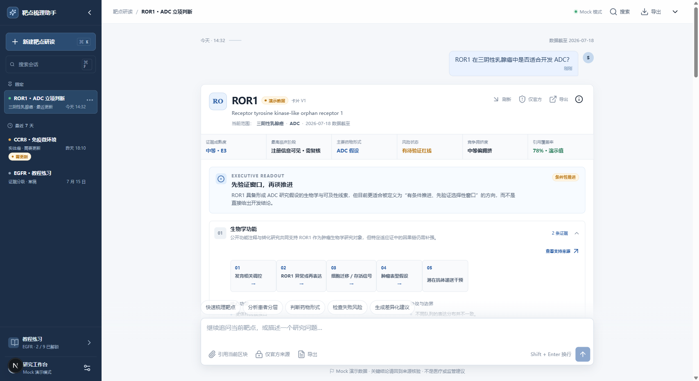
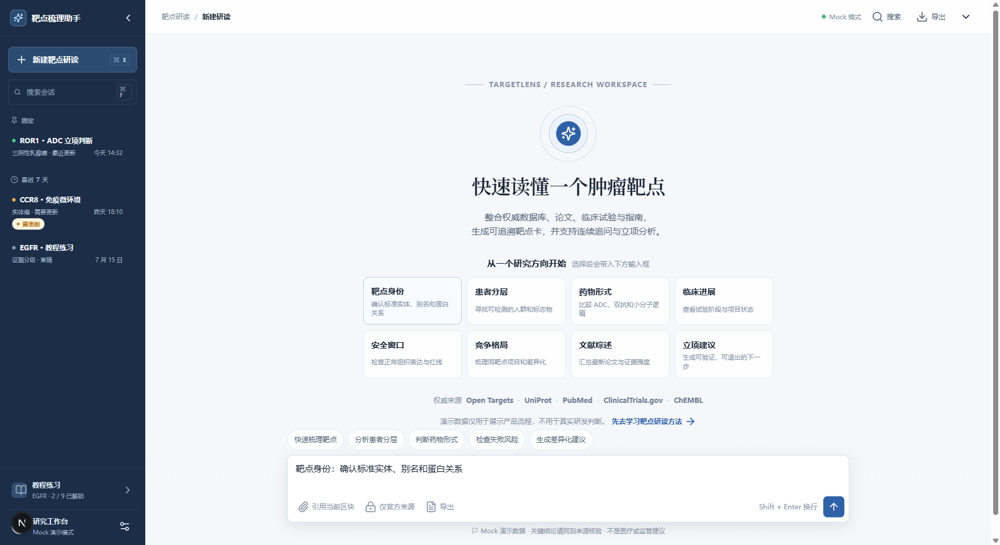
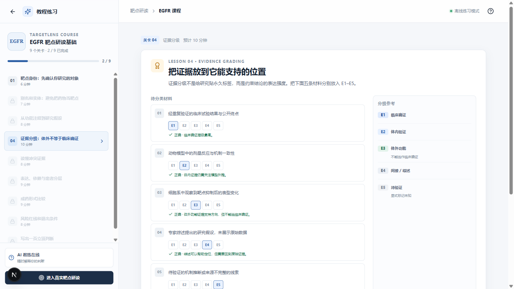
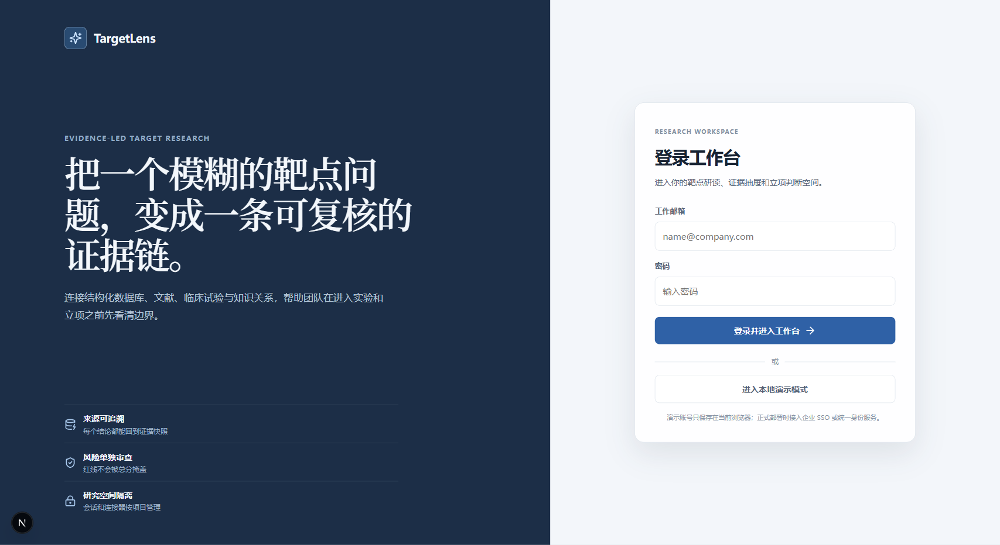

# TargetLens / 靶点梳理助手

> **当前版本：V1｜运行方式：本地部署｜云端状态：暂未部署**
>
> 本仓库公开的是经过脱敏处理的产品代码与演示素材，不包含真实 API 密钥、用户研究记录、私有证据缓存或内部知识图谱数据。

TargetLens 是面向肿瘤药物研发新人的证据驱动型靶点研读工作台。它把一个靶点问题拆成可追溯的检索步骤，从公开权威来源收集证据，再整理为便于继续追问和立项讨论的结构化卡片。



## V1 能做什么

- **动态靶点检索**：根据用户实际输入识别靶点、疾病和药物形式，不依赖固定卡片回答。
- **六部分研究卡片**：聚焦生物学功能、肿瘤表达、成药逻辑、代表药物、临床进展和失败风险。
- **来源可追溯**：保留来源链接、数据时间和连接状态；单个外部接口失败时明确降级，不补造结果。
- **连续一问一答**：问题、回答和研究卡按会话顺序保存，追问继承当前靶点上下文。
- **按需差异化建议**：只有用户明确请求时，才综合临床需求、靶点验证、竞争格局、近期风险和患者分层可执行性，输出五维建议与雷达图。
- **内部知识关系**：检索得到的关系可去重并保存到自建库，用于后续关联和上下文增强，不作为独立图谱卡片展示给用户。
- **本地账号隔离**：支持注册、登录和演示会话；公开成果库只提供只读示范内容。

## 研究流程

```text
用户问题
  → 靶点、疾病与药物形式归一化
  → 权威数据库、文献、临床试验与官方公告检索
  → 证据去重、来源分级与风险标记
  → 六部分靶点卡
  → 连续追问 / 按需差异化立项建议
```

V1 已接入或预留以下来源：

| 来源 | 主要用途 |
| --- | --- |
| UniProt | 蛋白和靶点身份 |
| Open Targets | 靶点、疾病与关联证据 |
| PubMed / Europe PMC | 公开文献检索与备用入口 |
| ClinicalTrials.gov | 临床试验注册记录 |
| ChEMBL | 化合物和药物线索 |
| 企业官网及交易所公告 | 已知项目合作、阶段和监管事件的官方补充 |

外部来源的可用性受网络、限速和接口策略影响。页面会区分 `READY`、`EMPTY` 和 `DEGRADED`，连接失败不等于没有相关证据。

## 界面预览

| 开始研究 | 教程练习 |
| --- | --- |
|  |  |

登录页支持本地账号和演示模式：



## 技术架构

```text
Next.js 15 / React 19
        │
        ▼
FastAPI ── PostgreSQL / Alembic
   │     ├─ Redis / Celery
   │     └─ MinIO
   ├─ 公开研究连接器
   └─ DeepSeek（可选，仅由服务端调用）
```

- 前端：Next.js App Router、TypeScript、Vitest
- 后端：FastAPI、Pydantic、SQLAlchemy、Alembic
- 基础设施：PostgreSQL、Redis、Celery、MinIO、Docker Compose
- AI：DeepSeek OpenAI-compatible Chat Completions，可关闭并安全降级

更详细的数据流和安全边界见 [架构说明](docs/ARCHITECTURE.md)。

## 仓库结构

```text
apps/
  web/                  # Next.js 前端
  api/                  # FastAPI、迁移、连接器和测试
docs/
  images/               # README 使用的公开演示截图
  ARCHITECTURE.md        # 架构与数据边界
  DECISIONS.md           # 关键工程决策
  ROADMAP.md             # V1 边界和部署前事项
compose.yaml             # 本地 API 与基础设施编排
```

## 本地运行

### 环境要求

- Node.js 20+
- pnpm 11+
- Python 3.11+
- [uv](https://docs.astral.sh/uv/)
- Docker Desktop（仅完整基础设施模式需要）

### 1. 启动前端演示

```powershell
pnpm install --frozen-lockfile
Copy-Item apps/web/.env.example apps/web/.env.local
pnpm dev
```

打开 `http://localhost:3000`。默认示例配置使用 Mock 数据，可直接体验 `/login`、`/workspace`、`/tutorial` 和 `/public-library`。

### 2. 启动后端

```powershell
Set-Location apps/api
Copy-Item .env.example .env
uv sync --extra dev
uv run uvicorn app.main:app --reload
```

健康检查：`http://localhost:8000/health`。

若需要启用 DeepSeek，只在本机 `apps/api/.env` 中设置：

```dotenv
AI_ENABLED=true
DEEPSEEK_API_KEY=你的本地密钥
```

真实密钥不得写入 `.env.example`、前端变量、源代码、Issue 或提交历史。

### 3. 启动本地基础设施

```powershell
docker compose up --build
```

该命令启动 PostgreSQL、Redis、MinIO、FastAPI 和 Celery worker；前端仍通过 `pnpm dev` 单独运行。Compose 对宿主机开放的端口只绑定到 `127.0.0.1`，不应直接作为生产部署配置。

## 检查命令

```powershell
pnpm lint
pnpm typecheck
pnpm test
pnpm build

Set-Location apps/api
uv run pytest -q
uv run ruff check app tests
uv run mypy app --ignore-missing-imports
```

## V1 边界

- 当前没有云端体验地址，克隆仓库后需在本地运行。
- 本地认证用于 V1 演示，不等同于生产级 SSO、审计和组织权限体系。
- 公开成果库是产品示范快照，不是实时研发结论，也不构成医疗、临床或投资建议。
- 云端部署前仍需完成托管密钥、生产数据库、HTTPS、限流、监控、备份和完整 E2E 验证。

部署前清单和后续计划见 [V1 路线图](docs/ROADMAP.md)。安全问题请阅读 [SECURITY.md](SECURITY.md)。

## 许可

本仓库用于成果展示和评审，未授予开源许可。具体范围见 [LICENSE](LICENSE)。
