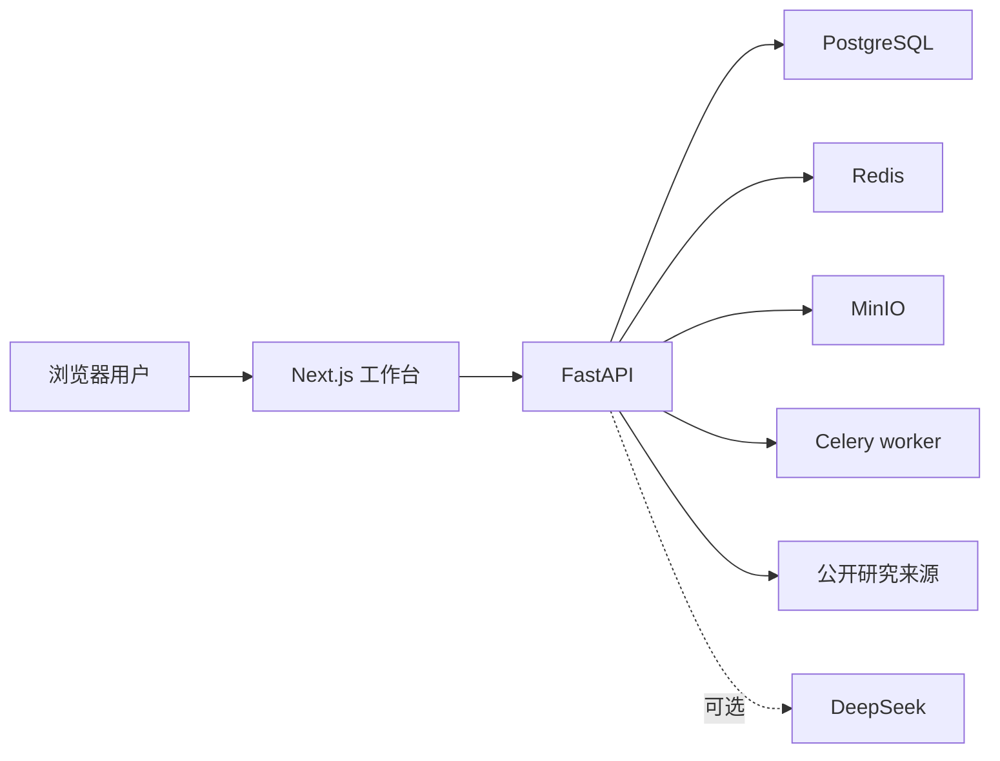

# TargetLens V1 架构说明

## 目标

TargetLens 把肿瘤靶点问题转化为可追溯的研究流程。系统负责检索、归一化、去重、结构化展示和上下文管理，不把模型生成内容包装成数据库事实，也不替代专业研发判断。

## 组件

- `apps/web`：登录、公开成果库、靶点工作台和教程界面。
- `apps/api`：身份会话、研究任务、来源连接器、靶点卡、证据、评分和建议接口。
- PostgreSQL：账号、会话、消息、证据快照、研究卡和内部知识关系。
- Redis / Celery：研究结果缓存和异步任务基础。
- MinIO：为报告等对象文件预留本地存储。

## 研究数据流

1. 从用户问题识别靶点、疾病和药物形式。
2. 并行访问启用的公开来源，每个连接器独立返回状态。
3. 对实体、证据和一跳关系进行归一化、去重和来源标记。
4. 生成六部分靶点卡，并把原始来源与卡片结论关联。
5. 后续追问携带当前会话、靶点卡和内部知识关系上下文。
6. 只有明确触发差异化建议时才生成五维 Decision Memo。

## 降级原则

- `READY`：来源返回了可用记录。
- `EMPTY`：请求成功，但没有符合条件的记录。
- `DEGRADED`：网络、限速、接口变更或解析异常导致来源不可用。
- 单个来源降级不会清空其他来源，也不会用模型补造记录。

## 公开与私有边界

公开仓库只包含源代码、示例配置、公开链接和演示截图。以下内容不得进入 Git：

- 真实 API 密钥和生产凭据；
- 用户问题、会话和未公开研究记录；
- 运行时数据库、缓存和内部知识关系数据；
- 本地 Word、PDF、表格及未经审查的项目材料。

浏览器只调用 TargetLens API；DeepSeek 密钥和数据库凭据只允许由服务端环境变量读取。
